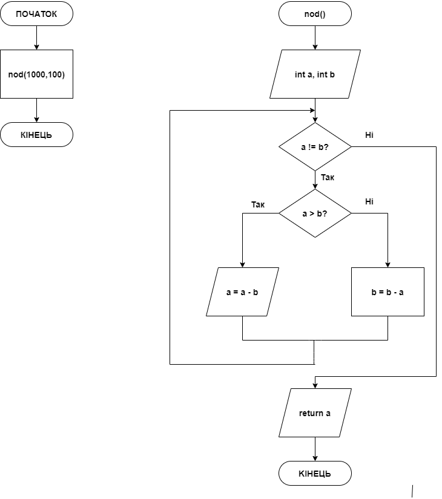

# Звіт до завдання 5.1

Визначити найбільший спільний дільник для двох заданих чисел

###1. Функція nod
		функція для пошуку НОД ->
		int nod(int a, int b){ 
		
		while(a != b){
	
		if( a > b ){
		
			a = a - b;	
			
		}	
		
		else{
		
			b = b - a;
		
		}
		
		}
	
			return a;

		}

###2. Функція main
		int main(){
	
		
			int result = nod(1000, 100); <- запис результату виконання функції в змінну
	
			printf("%d", result);

			return 0;
	
		}
###3. Блок-схема

