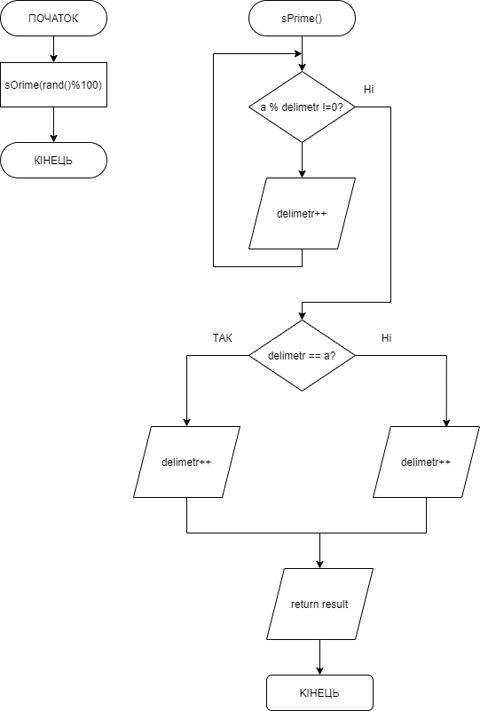

# Звіт до завдання 5.2

Визначити, чи є задане число простим?

###1. Функція sPrime
		bool sPrime(int a){
		
			int delimetr = 2;
		
			bool result;
	
			//ділимо початкове число до тих пір, поки деліметр при діленні на нього буде непарним
			while (a % delimetr != 0){
	
				delimetr += 1;
		
			}
	
			//якщо деліметр і початкове число рівні, то вертаємо true. Інакше false.
			if(delimetr == a){
	
				result = true;
		
			}else{
	
				result = false;
	
			}
	
			return result;
		
		}

###2. Функція main
		int main(){

			//функція sPrime() вертає тип bool. Якщо в ході перевірки вертається true, то число просте. Інакше не просте.

			if(sPrime(rand()%100) == true){
		
				printf("%s", "Prime");
			}else{
		
				printf("%s", "Not prime");
		
			}
	
	
		}
###3. Блок-схема

