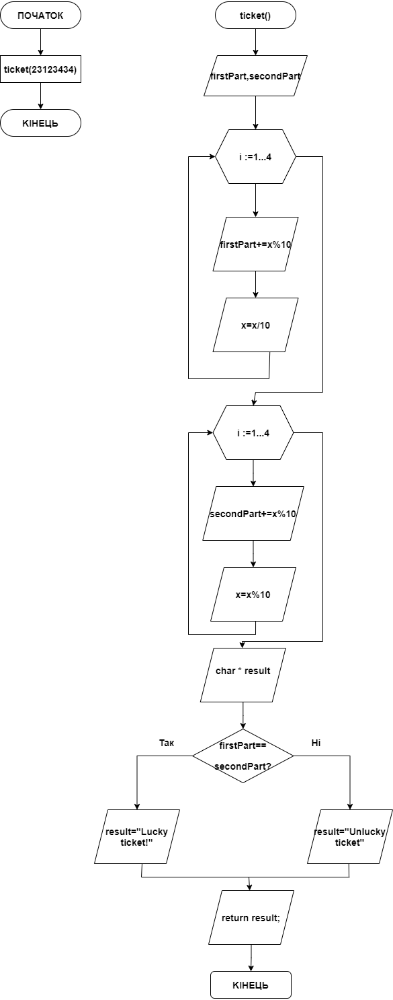

# Звіт до завдання 5.3

Визначити, чи є ціле 6-тизначне число "щасливим" квитком

###1. Функція ticket
		char * ticket(int x){
		
			int firstPart;
		
			int secondPart;

	
			for (int i = 1; i <= 4; i++){
	
				firstPart += x%10;
				x = x/10; 
	
			}

	
			for (int i = 1; i <= 4; i++){
	
				secondPart += x%10;
				x = x/10; 
	
			}
	
			char * result;
			
			
			if ((firstPart) == (secondPart)){
	
				result = "Lucky ticket!";
			
			}else{
	
				result = "Unlucky ticket";
	
			}
	
			return result;
	
		}

###2. Функція main
		int main(){
	

			char * result = ticket(23123434);

			printf("%s", result);

		}
###3. Блок-схема

