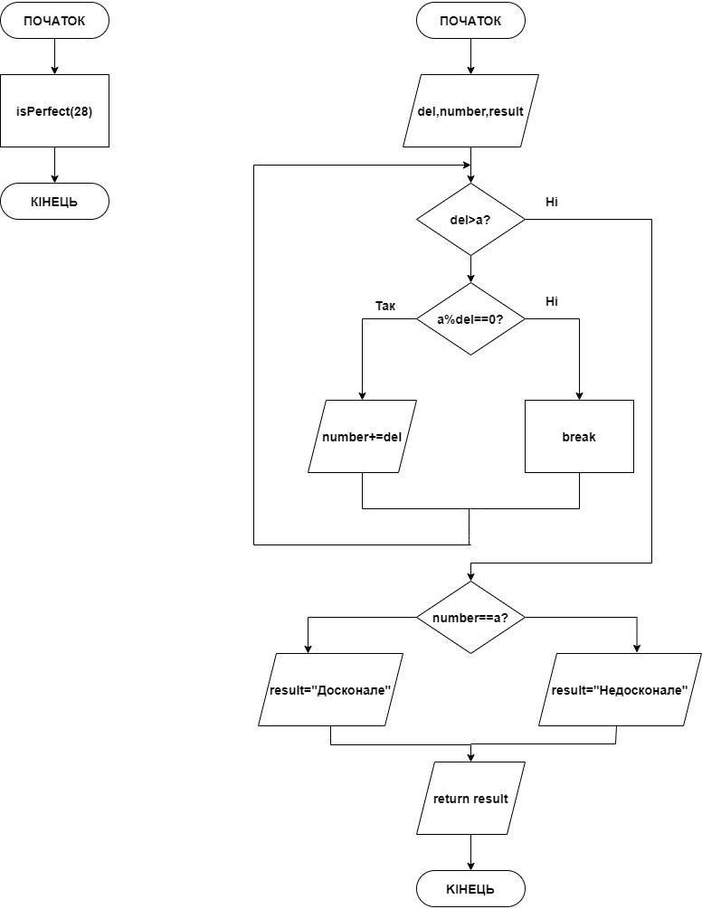

# Звіт до завдання 5.4

Визначити, чи є задане число досконалим (якщо воно дорівнює сумі своїх дільників)

###1. Функція isPerfect
		char * isPerfect(int a){
		
			int del = 1;
			
			int number = 0;
			
			char * result;
	
			//поки деліметр менше, ніж початкове число, то заходимо в цикл. Якщо в циклі початкове число ділиться без залишку на деліметр, то додам його до змінної number. Потім збільшуємо деліметр на 1
			
 			while (del < a){
 	
 				if(a%del == 0){
 		
 					number += del;
 		
 				}
 		
 				del++;
 	
 			}
 			
			//якщо сума дільників дорівнює початкового числа, то число абсолютно. інакше нi
	
			if(number == a){
	
				result = "Це досконале число!";
	
			}else{
	
				result = "Це не досконале число!";
	
			}
	
			return result;
		}

###2. Функція main
		int main(){
	
			//виводимо результат
			char * result = isPerfect(28);

			printf("%s", result);
	
			return 0;
	
		}
###3. Блок-схема

