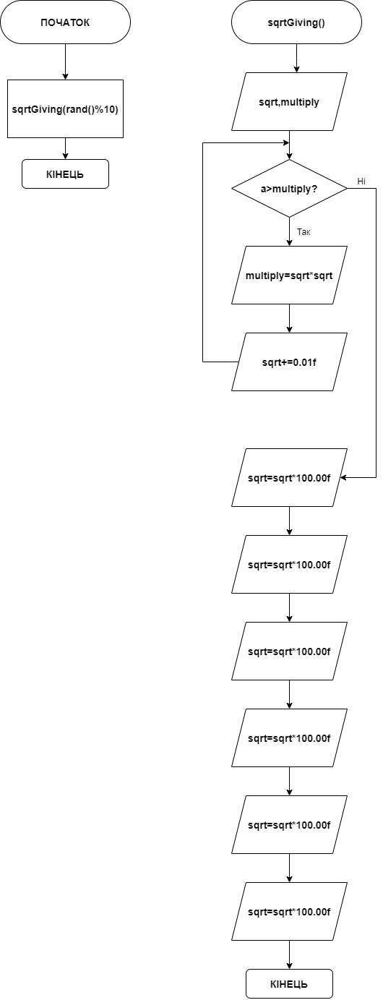

# Звіт до завдання 5.5

Без допомоги зовнішніх бібліотек отримати корінь числа

###1. Функція sqrtGiving
		float sqrtGiving(float a){
		
			float sqrt = 1.00f;
			
			float multiply;
	
			
 			while(a > multiply){
 	
 				multiply = sqrt * sqrt;
 	
 				sqrt+=0.01f;
 			}
 	
			
 			float sqrtF = sqrt*100.00f;
 			
 			int sqrtInt = (int)sqrtF;
 			
 			float sqrtI = (float)sqrtInt / 100.00f;
 			
 			float sqrtFloat = (float) (sqrtI);
 			
 			float result = sqrtFloat - 0.01f; //результат
	
			return result;
		}

###2. Функція main
		int main(){

			
			float sqrt = sqrtGiving((float)(rand()%10));

			printf("%f", sqrt);
	
		}
###3. Блок-схема

