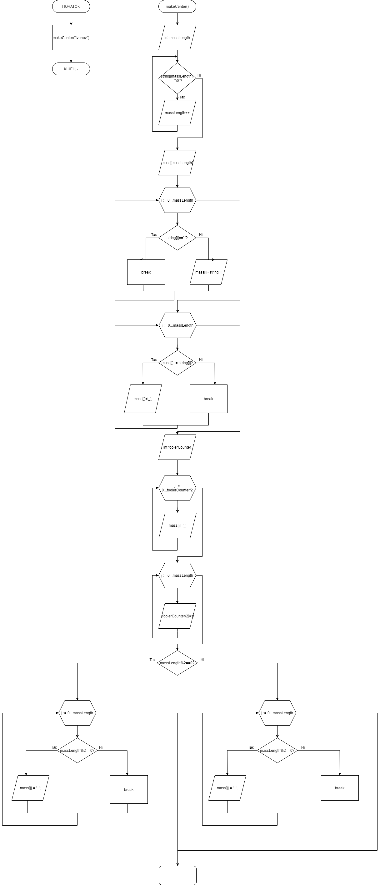

# Звіт до завдання 6.1

Центрувати рядок на площині із заданим заповнювачем

###1. Функція makeCenter
		void makeCenter(char string[]){
		
			int massLength = 0;
			
			
			while (string[massLength] != '\0')
			{
				massLength++;
			}
			
			char mass[massLength]; //массив вывода

			//разбираем строку string[] на символы и записываем ее в массив mass[25]
			for (int j = 0; j < massLength; j++){
			
				if (string[j] == ' '){
				
					break;
				
				}else{
				
					mass[j] = string[j];
				
				}
			
			}
			
			//проверяем на наличие схожих символов. Если их нет, то заполняем все каким нибудь "_"
			
			for (int j = 0; j<=massLength; j++){
			
				if(mass[j] != string[j]){
				
					mass[j] = '_';
							
				}
			
			}
			
			//создаем переменную, в которую будем записывать кол-во символов "_"
			
			int foolerCounter = 0;
			
			//считаем кол-во элементов массива с "_"
			
			for (int j = 0; j<=massLength; j++){
			
				if(mass[j] == '_'){
				
					foolerCounter++;
				
				}
			
			}
			
			//начинаем выравнивать массив: заполняем половиной полученного количества символов из переменной foolerCounter
			
			for (int j = 0; j<foolerCounter/2; j++){
			
				mass[j] = '_';
			
			}
			
			//заполняем массив начиная с первого пустого элемента элементами строки
			
			for (int j = 0; j<=massLength; j++){
			
				mass[j+foolerCounter/2] = string[j];
			
			}
			
			//дозаполняем массив оставшимимся "_". Для этого выполним проверку на пустоту
			
			if(massLength % 2 == 0){
			
				for (int j = 0; j<massLength; j++){
				
					if (mass[j] == ' ' || mass[j] == '\0'){
					
						mass[j] = '_';
					
					}
				
				}
				
			}else{
			
				for (int j = 0; j<=massLength; j++){
				
					if (mass[j] == ' ' || mass[j] == '\0'){
					
						mass[j] = '_';
					
					}
				
				}
			
			}
			
			//выводим результат

			for (int j = 0; j < massLength; j++){
			
				printf("%c", mass[j]);
			
			}

		}

###2. Функція main
		int main(){

			makeCenter("Ivanov         ");

			return 0;
			
		}
###3. Блок-схема

