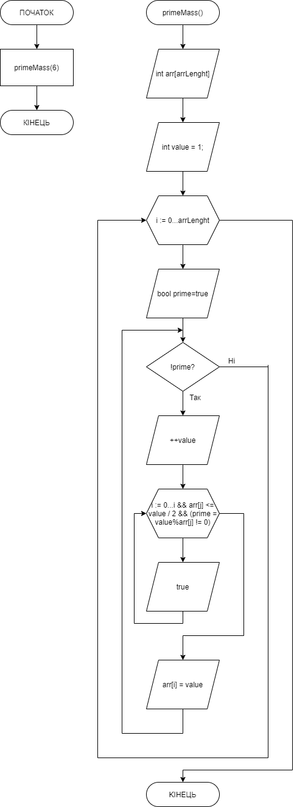

# Звіт до завдання 6.2

Заповнити масив із заданої кількості елементів простими числами, що не повторюються. Розмір вихідного масиву задати наперед відомим значенням, що може будуть більшим аніж результуюча кількість отриманих елементів

###1. Функція primeMass
		void primeMass(int arrLength){
    
		    	//обьявление массива и его длинны
		    	int arr[arrLength];
			
			//значение, которое в ходе цикла и условий будет преобретать значение простого числа 
			int value = 1;

			for (int i = 0; i < arrLength; i++)
			{
			
			    //переменная, обозначающая есть ли число простым. Если нет, то в цикле do...while будет выполняться сравнение до тех пор, пока число в переменной value не станет простым 
			    bool prime = true;
			    
			    do{
			    
				++value;
				
				for (int j = 0; j < i && arr[j] <= value / 2 && (prime = value % arr[j] != 0); ++j);
				
			    } while (!prime);

			    //записываем результат в каждый элемент массива arr[15]
			    arr[i] = value;
			    
			}

		    //выводим массив
		    for (int i = 0; i < arrLength; i++)
		    {
			printf("%d ", arr[i]);
		    }
		    
		}

###2. Функція main
		int main(){

		    //вызываем функцию с аргументом 6
		    
		    primeMass(6);

		    return 0;
			
		}
###3. Блок-схема

