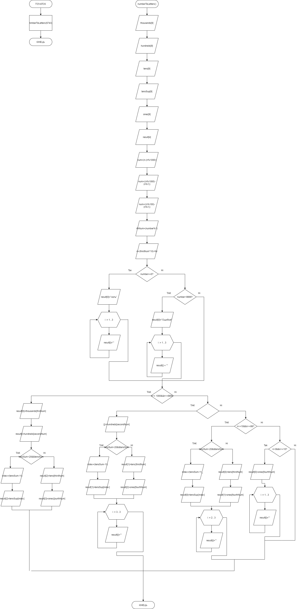

# Звіт до завдання 6.3

Перетворити число в рядок

###1. Функція numbersToLetters
		void numberToLetters(int number){
	
			char * thousands[9] = {"тысяча", "две тысячи", "три тысячи", "четыре тысячи", "пять тысячь", "шесть тысячь", "семь тысячь", "восемь тысячь", "девять тысячь"};
			char * hundreds[9] = {"сто", "двести", "триста", "четыреста", "пятьсот", "шестьсот", "семьсот", "восемьсот", "девятьсот"};
			char * tens[9] = {"десять", "двадцать", "тридцать", "сорок", "пятьдесят", "шестьдесят", "семьдесят", "восемьдесят", "девяносто"};
			char * tensSup[9] = {"одинадцать", "двенадцать", "тринадцать", "четырнадцать", "пятнадцать", "шестнадцать", "семнадцать", "восемнадцать", "девятнадцать"};
			char * ones[9] = {"один", "два", "три", "четыре", "пять", "шесть", "семь", "восемь", "девять"};

			char * result[4];

			int firstNum = (number - (number%1000))/1000;
			int secondNum = ((number%1000)-(number%100))/100;
			int thirdNum = ((number%100)-(number%10))/10;
			int fourthNum = (number%10);

			int tensSum = (thirdNum*10) + fourthNum;

			if (number == 0){

				result[0] = "ноль";

				for (int i = 1; i < 3; i++)
				{
					result[i] = " ";
				}

			}else if(number > 9999){

				result[0] = "Ошибка! Число больше чем 9999!";

				for (int i = 1; i < 3; i++)
				{
					result[i] = " ";
				}

			}

			
			if (number >= 1000 && number <= 9999){

				result[0] = thousands[firstNum-1];
				result[1] = hundreds[secondNum-1];

				if (tensSum < 20 && tensSum > 10){

					int index = (tensSum - 11);
					result[2] = tensSup[index];

				}else{

					result[2] = tens[thirdNum-1];
					result[3] = ones[fourthNum-1];

				}
				
			}else if(number >= 100 && number <= 999){

				result[0] = hundreds[secondNum-1];

				if (tensSum < 20 && tensSum > 10){

					int index = (tensSum - 11);
					result[1] = tensSup[index];

				}else{

					result[1] = tens[thirdNum-1];
					result[2] = ones[fourthNum-1];

				}

				for (int i = 3; i < 3; i++){
					
					result[i] = " ";
				
				}

			}else if(number >= 10 && number <= 99){

				if (tensSum < 20 && tensSum > 10)
				{

					int index = (tensSum - 11);
					result[0] = tensSup[index];

				}else{

					result[0] = tens[thirdNum-1];
					result[1] = ones[fourthNum-1];

				}

				for (int i = 2; i < 3; i++){

					result[i] = " ";
				
				}

			}else if(number > 0 && number <= 10){

				result[0] = ones[fourthNum-1];
				
				for (int i = 1; i < 3; i++){

					result[i] = " ";

				}
				
			
			}

			for (int i = 0; i < 4; i++){

				printf("%s ", result[i]);

			}
			

		}

###2. Функція main

		int main(){
			
			numberToLetters(6743);

			return 0;

		}

###3. Блок-схема

