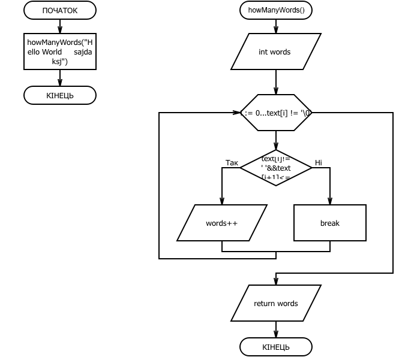

# Звіт до завдання 6.4

У заданому тексті знайти кількість слів за умови, що між словами може бути будь-яка кількість пропусків

###1. Функція howManyWords

	int howManyWords(char text[]){
		
		int words = 0; 

		//цикл для поиска количества слов в тексте
		
		for(int i = 0; text[i] != '\0'; i++){

			if(text[i] != ' ' && text[i+1] <= ' '){

				words++;

			}

		}   

		return words;
			
		}

###2. Функція main

		int main(){
			
			int result = howManyWords("Hello World     sajdaksj");

			printf("%d", result);
			
			return 0;
			
		}

###3. Блок-схема

