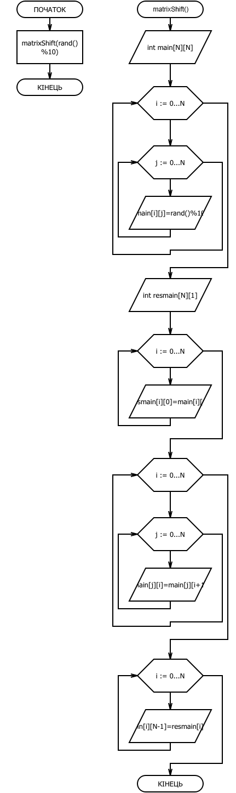

# Звіт до завдання 6.5

Дано двовимірний масив NxN цілих чисел. Виконати циклічне зрушення елементів рядків масиву в напрямку справа наліво

###1. Функція matrixShift

		void matrixShift(const int N){
		   
		    int main[N][N];
		    
		    for (int i = 0; i < N; i++)
		    {
			for (int j = 0; j < N; j++)
			{
			    main[i][j] = rand() % 10;
			}
		    }

		    
		    printf("%s","Исходная матрица: ");
		    printf("\n");
		    printf("\n");

		    for (int i = 0; i < N; i++)
		    {
			for (int j = 0; j < N; j++)
			{
			    printf("%d ", main[i][j]);
			}

			printf("\n");
			
		    }
		    
		    printf("\n");
		    printf("%s","Сдвинутая матрица: ");
		    printf("\n");
		    printf("\n");

		    int resmain[N][1];

		    
		    for (int i = 0; i < N; i++) {
		    
			resmain[i][0] = main[i][0];
		    
		    }

		    
		    for (int i = 0; i < N; i++)
		    {
		    
			for (int j = 0; j < N; j++)
			{
			
			    main[j][i] = main[j][i + 1];
			    
			}

		    }
		    
		    for (int i = 0; i < N; i++) {
		    
			main[i][N - 1] = resmain[i][0];
			
		    }

		    for (int i = 0; i < N; i++)
		    {
			for (int j = 0; j < N; j++)
			{
			
			    printf("%d ", main[i][j]);
				   
			}

		     printf("\n");

		    }
		    
		    
		}

###2. Функція main

		int main(){

		    matrixShift(rand()%10);

		    return 0;
		    
		}

###3. Блок-схема

