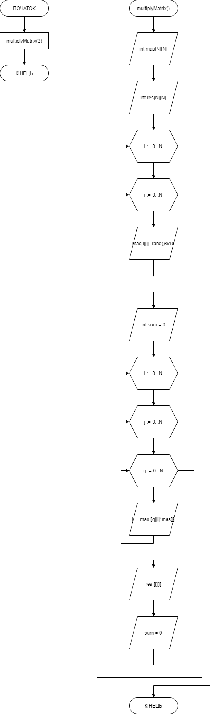

# Звіт до завдання 6.6

Дано двовимірний масив NxN цілих чисел. Помножити матрицю саму на себе

###1. Функція multiplyMatrix

		void multiplyMatrix(const int N){

		    int mas[N][N];
		    
		    int res[N][N];
		    
		    for (int i = 0; i < N; i++)
		    {
		    
			for (int j = 0; j < N; j++)
			{
			
			    mas[i][j] = rand() % 10;
			    
			}
			
		    }

		    for (int i = 0; i < N; i++)
		    {
		    
			for (int j = 0; j < N; j++)
			{
			
			    printf("%d", mas[i][j]);
			    
			    printf(" ");
			    
			}
			
			printf("\n");
			
			printf("\n");
			
		    }
		    
		    printf("\n");
		    
		    int sum = 0;
		    
		    for (int i = 0; i < N; i++)
		    {
		    
			for (int  j = 0; j < N; j++)
			{
			
			    for (int q = 0; q < N; q++)
			    {
			    
				sum = sum + mas[q][i] * mas[j][q];

			    }
			    
			    res[j][i] = sum;
			    
			    sum = 0;
			    
			}
			
		    }

		    
		    for (int i = 0; i < N; i++)
		    {
		    
			for (int j = 0; j < N; j++)
			{
			
			    printf("%d ", res[i][j]) ;
			    
			}
			
			printf("\n");
			
			printf("\n");
			
		    }

		}

###2. Функція main

		int main(){
		
		    
		    multiplyMatrix(3);
		   
		    return 0;

		}

###3. Блок-схема

