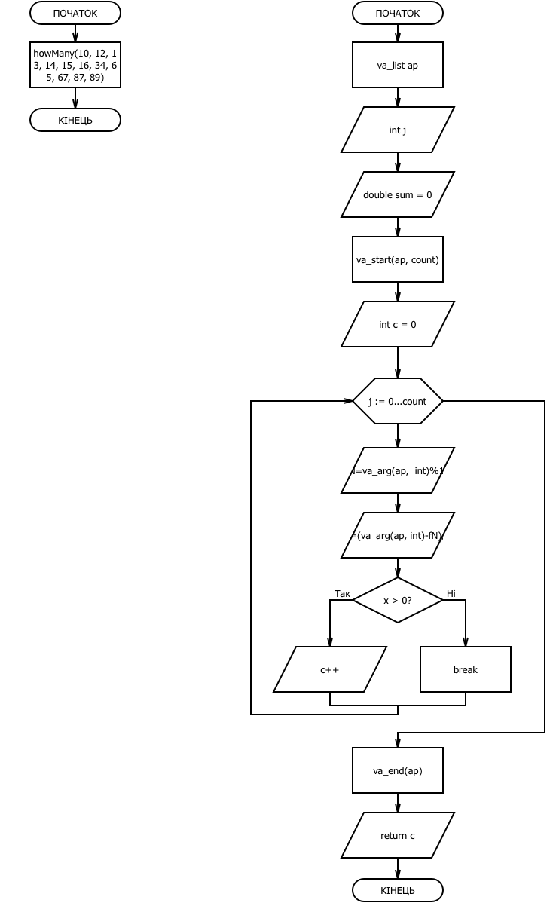

# Звіт до додаткового завдання з лабораторної работи №7

Реалізувати функцію, що визначає, скільки серед заданої послідовності чисел таких пар, у котрих перше число менше наступного, використовуючи функцію з варіативною кількістю аргументів

###1. Функція multiplyMatrix

		double howMany(int count, ...) { 
		    
		    va_list ap; 
		    
		    int j; 
		    
		    va_start(ap, count);
		    
		    int c = 0;
		    
		    for (j = 0; j < count; j++) { 

			int fN = va_arg(ap, int)%10;
			
			int sN = (va_arg(ap, int) - fN)/10;

			if(fN>sN) {
			
			    c++;
			    
			}
			
		    } 

		    va_end(ap); 

		  
		    
		    return c; 
		    
		} 

###2. Функція main

		int main() { 
		
		    double result = howMany(10, 12, 13, 14, 15, 16, 34, 65, 67, 87, 89);

		    printf("%f\n", result); 

		    return 0;

		} 

###3. Блок-схема

