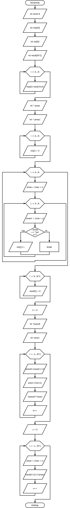

#Варіант №1

За формулою: Nt = ((5-1)%4) + 1 = 1

#  Загальне завдання
1. Дано масив із N цілих чисел. Визначити, чи є в масиві елементи, повторюються; якщо такі є, то створити масив, в якому вказати, скільки разів які елементи повторюються. Таким чином, в результуючому масиві кожен непарний елемент - число, що повторюється; кожен парний елемент - кількість повторювань.

#  Код завдання

		int main(){

		    int const N = 7;

		    int mas[N];

		    int res[N];

		    int result[N*2];

		    //заповнюємо початковий масив випадковими числами

		    for (int i = 0; i < N; i++)
		    {
			mas[i] = rand()%10;
		    }

		    int *pmas;
		    int *pmas1;

		    //обнуляємо результуючий масив
		    for (int i = 0; i < N; i++)
		    {
			res[i] = 0;
		    }

		    //перевіряємо на схожість кожне число. Якщо так, додаємо до результуючого масиву 1.
		    for (int i = 0; i < N; i++)
		    {
			pmas = (mas + i);

			for (int j = 0; j < N; j++)
			{
			    pmas1 = (mas + j);
			    
			    if ((*pmas) == (*pmas1)){
				res[j]++;            
			    } 

			}
			
		    }
		    
		    //обнуляємо кінцевий масив
		    for (int i = 0; i < N*2; i++)
		    {
			result[i] = 0;
		    }

		    int k = 0;

		    int *presult;
		    int *pres1;
		    
		    //заповнюємо кількість повторів цифр у масиві
		    for (int i = -2; i < (N*2); i+=2)
		    {
			presult = (result + i + 2);
			pres1 = (res + k);
			*presult = *pres1;
			k++;
		    }

		    int c = 0;

		    //заповнюємо самі числа 
		    for (int i = -1; i < (N*2); i+=2)
		    {
			pmas = (mas+c);
			result[i+2]=(*pmas);
			c++;
		    }

		    //виводимо результат

		    printf("Початковий масив чисел: \n");

		    for (int i = 0; i < N; i++)
		    {
			pmas = (mas + i);
			printf("%d ", *pmas);
		    }

		    printf("\n");
		    printf("\n");

		    printf("Кількість повторювань кожного числа: \n");

		    for (int i = 0; i < N*2; i++)
		    {
			printf("%d ", result[i]);
		    }
		    
		}

#  Опис дії програми

Спочатку оголошуємо масив з деякою кількістю чисел і результуючий масив. Потім заповнюємо його випадковими однозначними числами. Обнулюємо результуючий масив. Потім перевіряємо на схожість кожне число. Якщо так, додаємо до результуючого масиву 1. Потім обнулюємо кінцевий масив. За допомогою циклу for заповнюємо кількість повторів цифр у масиві у парні клітинки. Потім так само заповнюємо вже самі числа в непарні клітинки. Виводимо результат.

#  Блок-схема

#  Висновок

В даній лабораторній роботі я навчився працювати з вказівниками й будувати програми з ними.
