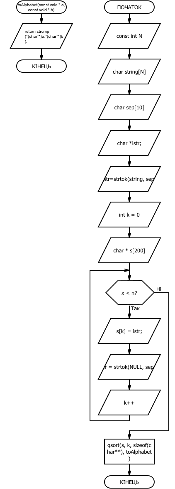

# Варіант №1

За формулою: Nt = ((5-1)%4) + 1 = 1

#  Загальне завдання
Визначити, скільки у тексті слів(без використання ітерації по кожному символу у циклі). Видати всі слова за абеткою.

#  Код завдання

		#include <stdio.h>
		#include <string.h>
		#include <stdlib.h> 

		//функция для сортировки строк по алфавиту
		int toAlphabet (const void * a, const void * b)
		{
		    return strcmp(*(char**)a,*(char**)b);
		}

		int main()
		{ 
		    const int N = 28;
		    char string[N] = "b g a c b t d k z b s k u e";
		    
		    char sep[10]=" ";
		    // Переменная, в которую будут заноситься начальные адреса частей
		    // строки str
		    char *istr;

		    // Выделение первой части строки
		    istr = strtok (string,sep);

		    int k = 0;

		    char * s[200];

		    //выделение последующих частей и занесение из изначального массива в массив s
		    while (istr != NULL)
		    {
		        s[k] = istr;
		        istr = strtok(NULL,sep); 
		        k++;
		    }

		    printf("Изначальная строка: \n");
		    //вывод результатов на экран
		    for(int i =0; i<k; i++){

		        printf("%s ", s[i]);

		    }
		    printf("\n");

		    printf("\n");

		    printf("Количество слов в строке: \n");

		    printf("%d\n", k);

		    printf("\n"); 
		 
		    //сортировка по возрастанию
		    qsort(s, k, sizeof(char**), toAlphabet);

		    printf("Отсортированная строка: \n");
		    //вывод результатов на экран
		    for(int i =0; i<k; i++){

		        printf("%s ", s[i]);

		    }

		    printf("\n");

		}

#  Опис дії програми

Спочатку оголошуємо заголовки stdio.h, string.h i stdlib.h. Потім оголошуємо функцію toAlphabet, яка буде сортувати масив за алфавітом. Потім починається наша программа. В ній оголошуємо наш масив й заповнюємо його. Заносимо в змінну sep сепаратор, за яким будемо ділити строку на слова. Потім оголошуємо змінну, в яку будуть заноситися початкові адреси частин. Потім виділяємо першу частину строки. За допомогою цикла while виділяємо послідуючі частини й заносимо з початкового масиву в масив s. За тим все сортуємо викликавши функції qsort, в якій ми останнім аргументом передамо нашу функцію сортування за алфавітом. Потім за допомогою циклів виводимо результат.

#  Блок-схема

#  Висновок

В даній лабораторній роботі я навчився працювати з строками й будувати програми з ними.
